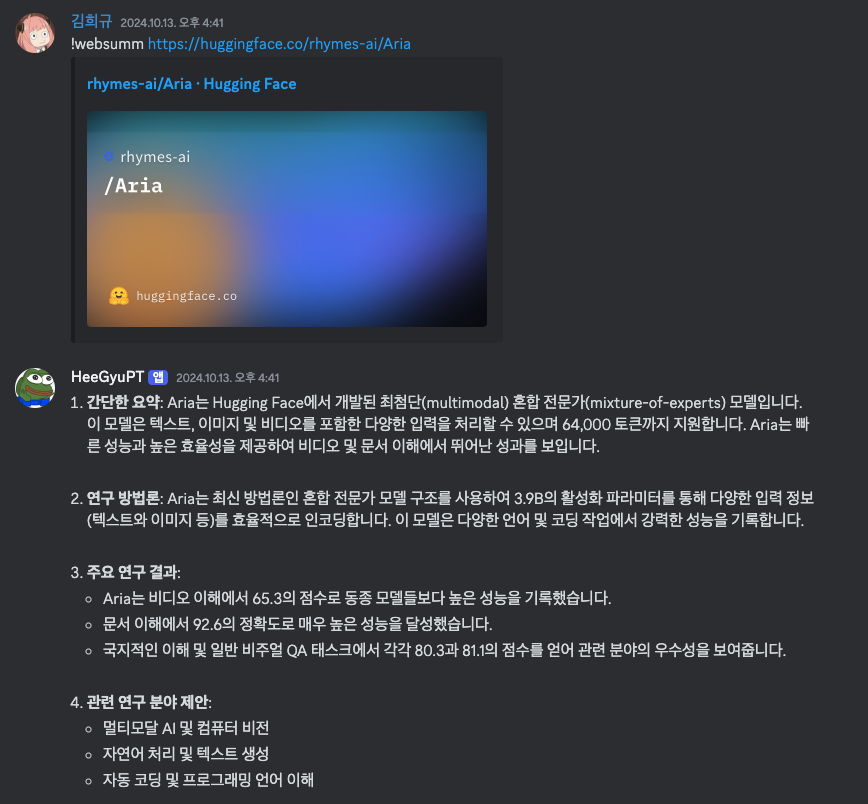
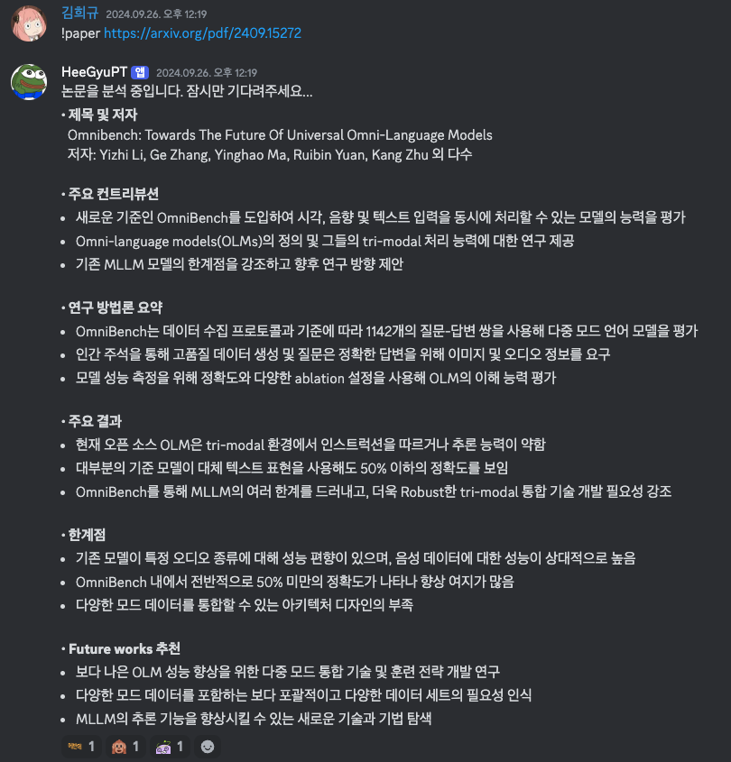

# HeegyuPT

HeegyuPT는 대학원생의 연구를 도와주기 위한 디스코드 봇입니다. 웹 페이지와 PDF 문서를 요약하는 기능을 제공합니다.
디스코드에서 주요 뉴스를 요약하거나 학술 논문의 내용을 파악하고 전달하는데 도움이 됩니다.

## 주요 기능

### 웹 페이지 요약


HeegyuPT는 웹 페이지의 내용을 간결하게 요약하여 제공합니다. 복잡한 웹 문서의 핵심 내용을 빠르게 파악할 수 있습니다.

### PDF 문서 요약


PDF 파일 URL 또는 arXiv URL을 입력하면 해당 문서의 요약본을 생성합니다. 학술 논문이나 긴 보고서의 핵심 내용을 쉽게 이해할 수 있습니다.

## 설치 방법

HeegyuPT를 사용하기 위해 필요한 패키지를 설치합니다:

```bash
pip install -r requirements.txt
```

본 프로젝트는 웹 요약을 위해 [crawl4ai](https://github.com/unclecode/crawl4ai), PDF 요약을 위해 [omniparse](https://github.com/adithya-s-k/omniparse), 그리고 텍스트 생성을 위해 OpenAI를 사용합니다.

### PDF 요약을 위한 omniparse 도커 실행

PDF 요약 기능을 사용하려면 다음 명령어로 omniparse 도커 컨테이너를 실행해야 합니다:

```bash
docker pull savatar101/omniparse:0.1

# GPU를 사용하는 경우 (모델 로딩에 시간이 소요될 수 있습니다)
docker run --gpus all --net host -itd savatar101/omniparse:0.1
```

## 사용 방법

HeegyuPT를 실행하기 위해 다음 환경 변수를 설정해야 합니다:

```bash
OPENAI_API_KEY="YOUR_OPENAI_API_KEY"
DISCORD_BOT_TOKEN="YOUR_DISCORD_BOT_TOKEN"
RESTAURANT_CHANNEL_ID="YOUR_DISCORD_CHANNEL_ID" # 아주대학교 식당 메뉴 전송용 (선택사항)
```

`RESTAURANT_CHANNEL_ID`는 아주대학교 식당 메뉴를 전송하기 위한 채널 ID입니다. 설정하지 않으면 메뉴 전송 기능이 비활성화됩니다.

이제 HeegyuPT를 사용하여 웹 페이지와 PDF 문서를 쉽게 요약할 수 있습니다. 디스코드 서버에서 여러분의 봇을 생성한 뒤 초대하고 명령어를 통해 요약 기능을 사용해보세요!

### 도커로 쓰기
1. run.sh 파일을 만들어서 아래 내용을 적어줍니다.
```bash 
export OPENAI_API_KEY=
export DISCORD_BOT_TOKEN=
export RESTAURANT_CHANNEL_ID=
export FIREBASE_PROJECT_ID=
export HEEGYUPT_WEB_URL=
python main_discord_bot.py
```

2. run_server.sh 파일을 만들어서 아래 내용을 적어줍니다.
```bash
export FIREBASE_PROJECT_ID=
gunicorn app:app -b 0.0.0.0:5000
```
2. 아래 명령어로 Docker 이미지를 빌드한 뒤 실행합니다.
```bash
# Discord 봇 실행
docker build -f Dockerfile.discord -t heegyupt-discord .
docker run -itd --restart always --net host heegyupt-discord

# 웹 서버 실행 (포트 5000 사용)
docker build -f Dockerfile.webserver -t heegyupt-webserver .
docker run -itd --restart always -p 5000:5000 heegyupt-webserver
```